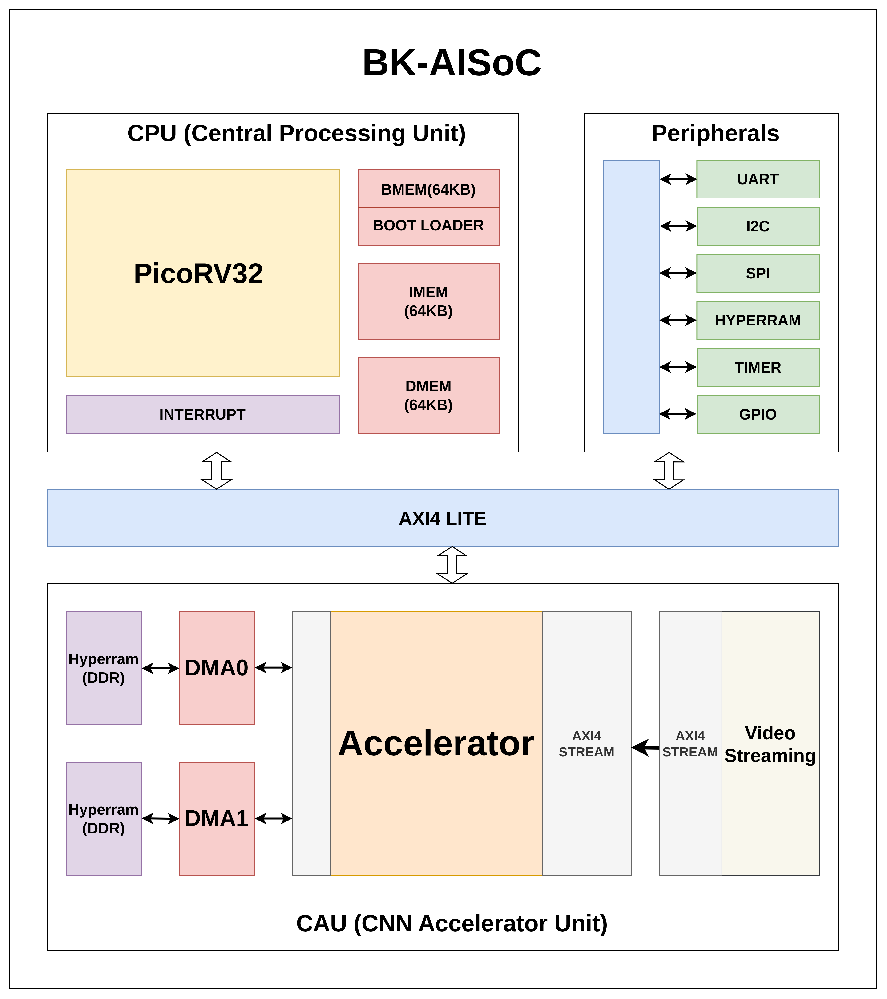

# ASIC-Oriented RISC-V AI SoC Platform

Repository này trình bày nền tảng **RISC-V AI SoC định hướng ASIC**, bao gồm kiến trúc hệ thống, firmware, luồng tăng tốc CNN, tài liệu thesis và video demo thực nghiệm.

## Liên Kết Nhanh

- **Report thesis:** [docs/report-thesis/main.pdf](docs/report-thesis/main.pdf)
- **Video demo:** [Google Drive demo folder](https://drive.google.com/drive/folders/19oA3CzA9WKEoQ1JPa15cW4yM1nDpZaN2?usp=sharing)
- **ASIC GDS:** [Google Drive GDS folder](https://drive.google.com/drive/folders/1tW2MXlDJZ_YXgO_VqpCdJiTTwywh9T0n?usp=sharing)
- **ASIC source:** [Google Drive ASIC source folder](https://drive.google.com/drive/folders/174MNBMLwhTpfknMjO55SqrUgjreBZlFh?usp=sharing)
- **Hình kiến trúc:** [docs/images/soc-architecture.png](docs/images/soc-architecture.png)

## Mục Tiêu Dự Án

Dự án tập trung xây dựng một nền tảng SoC phục vụ các bài toán AI nhúng, có khả năng triển khai trên FPGA và định hướng tiến tới ASIC. Hệ thống kết hợp CPU RISC-V, firmware điều khiển, các ngoại vi SoC, bộ nhớ ngoài và khối CNN accelerator để chạy demo nhận diện theo thời gian thực.

Các phần chính:

- Thiết kế nền tảng SoC dựa trên RISC-V.
- Tích hợp firmware, bootloader và lớp SoC HAL.
- Tích hợp các ngoại vi như UART, SPI/HYPERRAM, I2C, GPIO, timer, HyperRAM và Video Streaming.
- Xây dựng luồng CNN accelerator cho tác vụ AI nhúng.
- So sánh và kiểm chứng kết quả với golden model chạy trên host.
- Trình bày báo cáo thesis, kiến trúc hệ thống và video demo.

## Kiến Trúc Hệ Thống



Luồng xử lý tổng quát:

```text
Camera / Input data
        |
        v
Video streaming + preprocessing
        |
        v
RISC-V SoC firmware
        |
        v
CNN accelerator + DMA/memory subsystem
        |
        v
UART / Host dashboard / Demo output
```

## Hiện Thực ASIC

Phần ASIC của dự án bao gồm dữ liệu layout cuối cùng và source thiết kế dùng cho luồng triển khai ASIC.

- **GDS:** [Google Drive GDS folder](https://drive.google.com/drive/folders/1tW2MXlDJZ_YXgO_VqpCdJiTTwywh9T0n?usp=sharing)
- **Source ASIC:** [Google Drive ASIC source folder](https://drive.google.com/drive/folders/174MNBMLwhTpfknMjO55SqrUgjreBZlFh?usp=sharing)

Trong đó, thư mục GDS dùng để lưu kết quả layout tapeout/final layout, còn thư mục source ASIC chứa mã nguồn và các file cần thiết để kiểm tra hoặc tái tạo luồng thiết kế ASIC.

## Ghi Chú

Repository này được trình bày theo hướng giúp người xem GitHub nắm nhanh ba lớp thông tin:

- **Tài liệu:** report thesis và hình kiến trúc.
- **Hiện thực:** firmware, driver, accelerator flow và host tool.
- **Kết quả:** video demo và dashboard/golden model.
